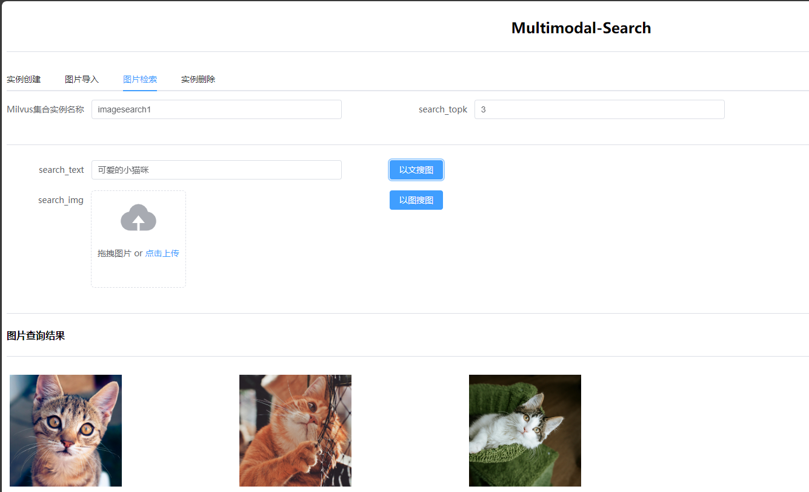

# Multimodal-Search

以文搜图  以图搜图  多模态检索演示

## (1) Requirements
- docker
- milvus
```shell
# start milvus
wget https://github.com/milvus-io/milvus/releases/download/v2.5.10/milvus-standalone-docker-compose.yml -O docker-compose.yml
docker compose up -d
```

## (2) Get Started

```shell
# run multimodal-search
docker run -itd --name mmultimodal_search_server -p 8081:8081 registry.cn-beijing.aliyuncs.com/luckercs/multimodal-search:1.0
```
通过浏览器访问 http://localhost:8081



## (3) 架构


## (4) Thanks

如果这个项目对你有帮助，欢迎扫码打赏！


感谢你的慷慨解囊，你的支持是我前进的动力！
